# a2-cp3402-2019-team02
a2-cp3402-2019-team02 created by GitHub Classroom

#CP3402 Assignment 2 & Presentation
May 2019

#Team members:
- Hendrik Nel
- Broderick Thomsen
- Greg McLindon
- Dan Archer
- Kipngetich Kemei

# The Coffee Can
The Coffee Can is a cafe that offers a variety of foods, coffees, and sweet treats. This document outlines the development guidelines for The Coffee Can's website.

## Getting Started
Coffeecan website consists of a Live site, staging site and several local development site for each team member.
Each team member has established the same development stack on their local pc consisting of the Wordpress installed on a WAMP server with phpMyAdmin database. We are all using PhpStorm IDE and have git version control on the Wordpress content files as well as a full export of both the staging site (located in the main branch) and the production site (located in the production branch).

Each team member also participates in the development of the site locally and pushes their edits to the master branch of the GitHub repository accessed by each team member. At the same time, each team also pushes the updates to the staging database using the ‘All-in-One WP Migration - https://en-au.wordpress.org/plugins/all-in-one-wp-migration/’ plugin via the plugins' import/export functionality, as well as uploading their export of the database onto the main branch of the github repository allowing for version control.

This means the staging site is always up to date and that all team members can then access the main repository, and import the most recent website export file into their local development website and begin their work.

The staging database is then pushed to the live site also using the 'All-in-One WP Migration' plugin as required by a designated team member.

In order to ensure that you are ready to begin contributing to the development of this project, you must ensure that you have downloaded and installed all of the outlined pre-requisite items. Once this has been completed successfully, please move on to the 'Installing' section.

## Prerequisites
What things you need to install and how to install them
1. Install Wampserver - https://sourceforge.net/projects/wampserver/ 
(Note: This is Window users only. Mac users can install MAMP - https://www.mamp.info/en/)
2. Download wordpress install zip file - https://wordpress.org/download/
3. The 'All-in-One WP Migration' plugin - https://en-au.wordpress.org/plugins/all-in-one-wp-migration/
4. The 'All-in-One WP Migration File Extension' - https://import.wp-migration.com/   Note: Download the one labeled 'Basic'

## Installing
1. Create new folder in WAMP localhost folder www - i.e. C:\wamp64\www\coffeecan_local
Note: this folder name is optional i.e. coffeecan_local1, coffeecan_local2 etc.

2. Extract contents of wordpress zip file to coffeecan_local folder
	a. OPTIONAL: If your folder structure is now: C:\wamp64\www\coffeecan_local\wordpress\ then copy all the content of the wordpress folder and paste it into the the ‘coffeecan_local’ folder. Then delete the ‘wordpress’ folder. This step makes the local url for your development site a little cleaner in later steps.
	
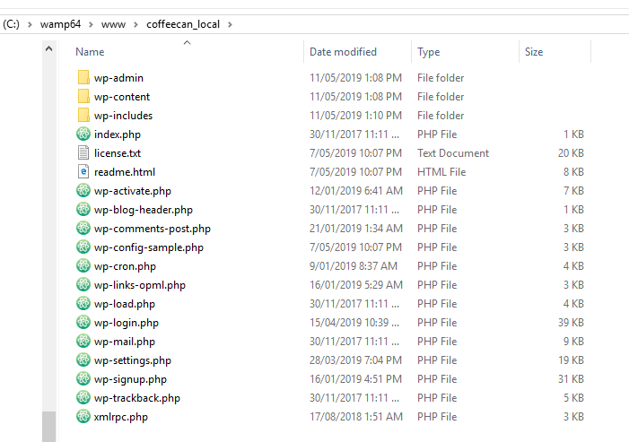

3. Turn on Wampserver.

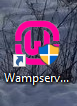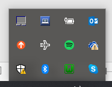

4. Open phpMyAdmin database that is packaged in WAMP server (leave settings at default i.e. root / blank password / mysql).

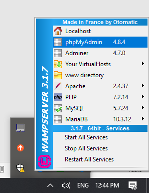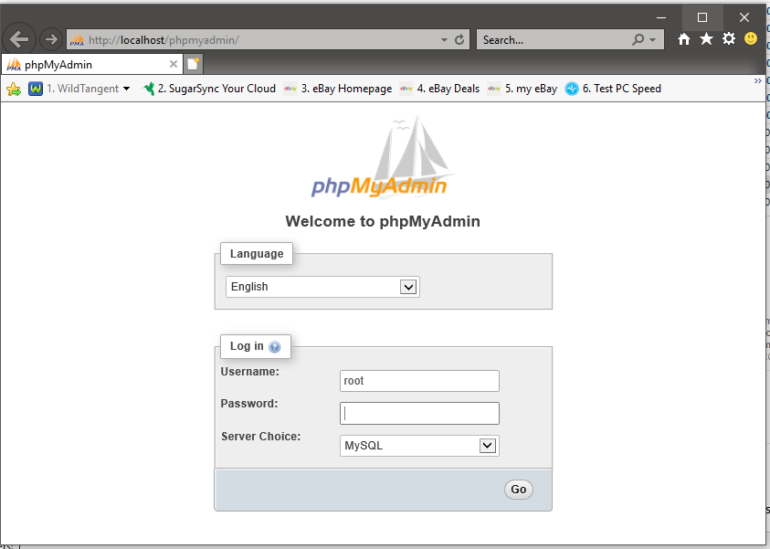

5. Create a new database (name optional i.e. cc_local) (we will be syncing this database to the staging server so this is all that is required for now).

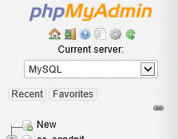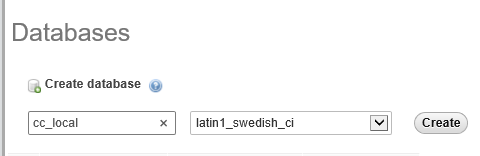

6. Open local site in browser: (URL: localhost/coffeecan_local/).

7. Complete Wordpress install (database details: cc_local \ root \ no password \ wp_ ).

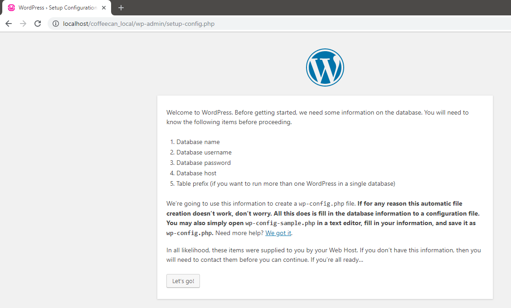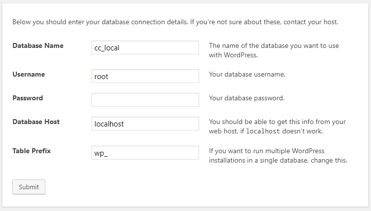

8. Complete the installation. Ensure to use a strong password and take note of your password.

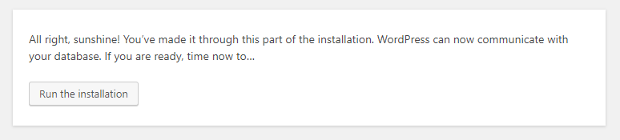
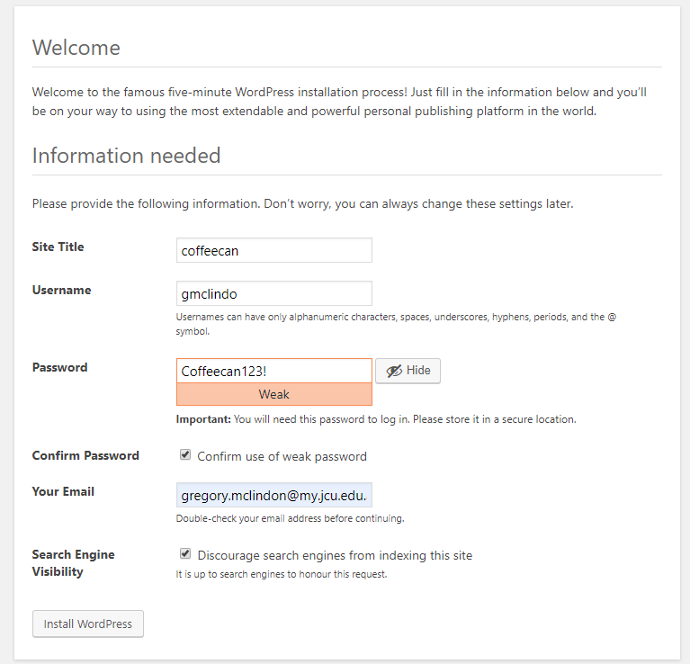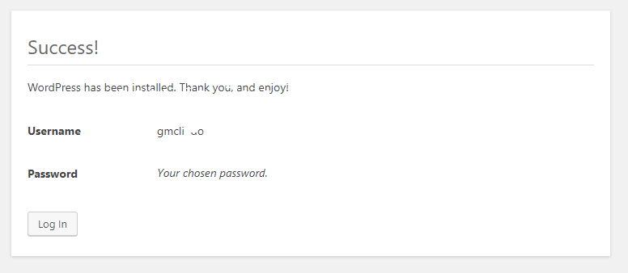

9. Log into site.

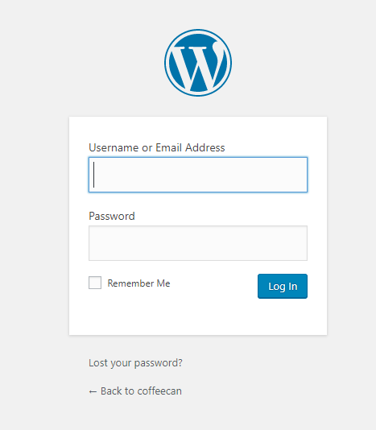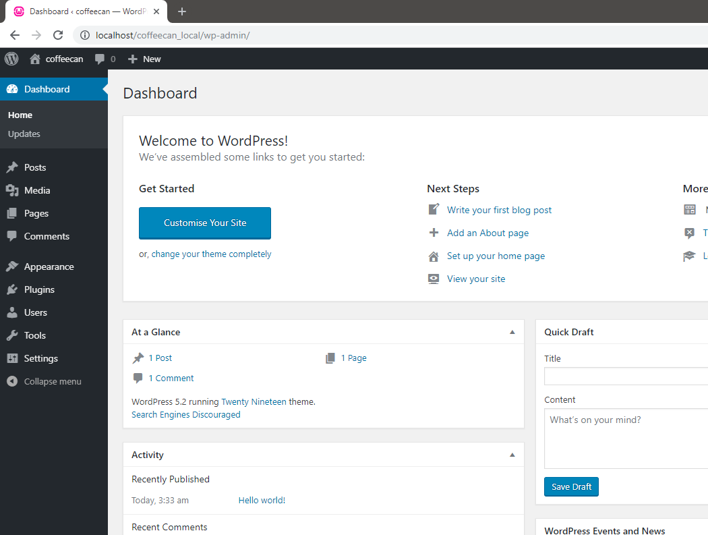

10. Install and activate plug-in called ‘All-in-One WP Migration’ (once activated it will be visible in installed plugins section of Wordpress dashboard).

11. Visit main branch of github repository https://github.com/cp3402-students/a2-cp3402-2019-team02 , download the latest website export that can be found there.

12. Via the 'All-in-One WP Migration' plugin, import the downloaded website export.

13. Done, you now have The most recent version of the staging website.

NOTE:
●	Your log in details to your local website may no longer be valid because we just overrode the user details in the local database with the users listed in the staging website. 

To fix, log into the site using the admin account details: 
- Username: admin
- Password: team2password
Then add yourself back as a user in the WordPress users page. Once you’ve done this, immediately sync your local environment to the staging environment so that your credentials are uploaded to the staging server.

### Deployment
Once finished with your work and all changes are tested and proven to be functional and without errors, export your new version of the website via the 'All-in-One WP Migration' plugin.

2. For Local -> Staging:
	- Export the new version of the website via the 'All-in-One WP Migration' plugin
	- Visit the staging website: http://130.211.235.221/
	- Access the wp-admin screen with the previously provided admin account details
	- Via the 'All-in-One WP Migration' plugin, import the file obtained during the beginning of the 'Local -> Staging' process
	- Follow the on-screen instructions until the import sucessfully completes
	- Finished, the staging site now contains the most recent version of the website

3. For Staging -> Production:
	Either
	- Visit the staging website at http://130.211.235.221/
	- Export the website via the 'All-in-One WP Migration' plugin
	- Visit the live website at http://35.244.90.129/
	- Import the new version of the website via the 'All-in-One WP Migration' plugin
	
	Or
	- Download the most recent website export file in the main branch of the github repository
	- Visit the live website at http://35.244.90.129/
	- Import the new version of the website via the 'All-in-One WP Migration' plugin

For accurate version control:
1. Upload the exported file onto the main branch of the github repository. 
Note: Do not delete the existing one, as backups are important in case of any issues with new versions.

2. Replace the existing wp-content folder in the main branch of the github repository with the contents of your local websites' wp-content folder

3. Commit your changes to the main branch of the github repository (include all necessary/relevant comments detailing your commit).

## Built With
- Wordpress: https://wordpress.org/
- WAMP: https://orion.managewp.com/
- All-in-One WP Migration plugin: https://en-au.wordpress.org/plugins/all-in-one-wp-migration/
- All-in-One WP Migration File Extension (Basic version): https://en-au.wordpress.org/plugins/all-in-one-wp-migration/

## Versioning
Versioning is largely handled by github via the use of commits to both the main and production branches of the github repository.

## Authors
- Kip Kemei : 
	- Github - https://github.com/kkemei
	- LinkedIn - https://www.linkedin.com/in/kipngetich-kemei-b83381117/
- Broderick Thompson :
	- Github - https://github.com/BroderickWST
	- LinkedIn - https://www.linkedin.com/in/broderick-thomsen-30a28b117/
- Greg McLindon :
	- Github - https://github.com/GregMcLindon
	- LinkedIn - https://www.linkedin.com/in/greg-mclindon-0ab54b186/ 
- Hendrik Nel :
	- Github - https://github.com/Comedy112
	- LinkedIn - https://www.linkedin.com/in/hendrik-nel-350175b5/
- Dan Archer :
	- Github - https://github.com/danarcher96
	- LinkedIn - https://www.linkedin.com/in/dan-archer-9801bb16b/

## License
This project is licensed under the MIT License - see the LICENSE.md file for details

## Acknowledgments
- All contributing members of the development team, with special thanks to: Kip Kemei, Broderick Thompson, Greg McLindon, Dan Archer, Hendrik Nel
- Sharon (the client - owner of The Coffee Can), for her excellent and expert feedback regarding the development of the website

