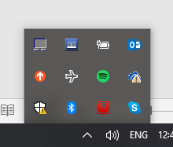

# a2-cp3402-2019-team02
a2-cp3402-2019-team02 created by GitHub Classroom

#CP3402 Assignment 2 & Presentation
May 2019

#Team members:
- Hendrik Nel
- Broderick Thomsen
- Greg McLindon
- Dan Archer
- Kipngetich Kemei

# The Coffee Can
The Coffee Can is a cafe that offers a variety of foods, coffees, and sweet treats. This document outlines the development guidelines for The Coffee Can's website.

## Getting Started
Coffeecan website consists of a Live site, staging site and several local development site for each team member.
Each team member has established the same development stack on their local pc consisting of the Wordpress installed on a WAMP server with phpMyAdmin database. We are all using phpStorm IDE and have git version control on the Wordpress content files.
Each team member also participates in the development of the site locally and pushes their edits to the master branch of the GitHub repository accessed by each team member. At the same time, each team also pushes the updates to the staging database using the ‘ManageWP Worker’ plugin via a ManageWP/GoDaddy intermediary service provider site.
This means the staging site is always up to date. Team members can then sync from the staging site to their local site when they begin a development session.
The staging database is then pushed to the live site also using the ManageWP Worker’ plugin as required by a designated team member.

In order to ensure that you are ready to begin contributing to the development of this project, you must ensure that you have downloaded and installed all of the outlined pre-requisite items. Once this has been completed successfully, please move on to the 'Installing' section.

## Prerequisites
What things you need to install and how to install them
1. Install Wampserver - https://sourceforge.net/projects/wampserver/ 
(Note: This is Window users only. Mac users can install MAMP - https://www.mamp.info/en/)
2. Download wordpress install zip file - https://wordpress.org/download/

## Installing
1. Create new folder in WAMP localhost folder www - i.e. C:\wamp64\www\coffeecan_local
Note: this folder name is optional i.e. coffeecan_local1, coffeecan_local2 etc
2. Extract contents of zip file to coffeecan_local folder
	a. OPTIONAL: If your folder structure is now: C:\wamp64\www\coffeecan_local\wordpress\ then copy all the content of the wordpress folder and paste it into the the ‘coffeecan_local’ folder. Then delete the ‘wordpress’ folder. This step makes the local url for your development site a little cleaner in later steps.
	

3. Turn on Wampserver

4. Open phpMyAdmin database that is packaged in WAMP server (leave settings at default i.e. root / blank password / mysql)

5. Create a new database (name optional i.e. cc_local) (we will be syncing this database to the staging server so this is all that is required for now).

6. Open local site in browser: URL: localhost/coffeecan_local/
7. Complete Wordpress install (database details: cc_local \ root \ no password \ wp_ )

8. Complete the installation. Ensure to use a strong password and take note of your password.

9. Log into site

10. Install and activate plug-in called ‘manageWP Worker’ (once activated it will be visible in installed plugins section of Wordpress dashboard)

11. Log into staging server dashboard 
- URL: https://orion.managewp.com/login
- Login: kipngetich.kemei@my.jcu.edu.au
- Password: cms123

12. Open the staging site dashboard:

13. Go to ‘local sync’ BETA tab

14. Enter local URL: http://localhost/coffeecan_local/

15. Click on 2nd icon showing server to local site:

16. Confirm establish local connection to WAMP server. Do not close the pop-up container with connection details.

17. Once connection established, click ‘sync files’ to confirm. Files then begin to transfer.

18. Congratulations! Your local site is now up to date with the staging site
Or
Take note of any files that failed to download (you may need to retrieves these from the git repo)

19. Log out of staging site
20. Restart your browser and access local site and dashboard at:

http://localhost/coffeecan_local/
http://localhost/coffeecan_local/wp-login.php

NOTE:
●	Your log in details to your local website may no longer be valid because we just overrode the user details in the local database with the users listed in the staging website. 

To fix, log into the site using the admin account details: 
- Username: admin
- Password: team2password
Then add yourself back as a user in the WordPress users page. Once you’ve done this, immediately sync your local environment to the staging environment so that your credentials are uploaded to the staging server.

### Deployment
As outlined in this document, you utilize https://orion.managewp.com/ for pushing from your local development environment onto the staging site as well as pulling to your local environment from the staging site. In order to push to the live site, you need to pull the most recent version of the website from the staging site to your local environment, and then push from your local environment to the live site.

## Built With
- Wordpress: https://wordpress.org/
- WAMP: https://orion.managewp.com/login

## Versioning
Versioning is largely handeld by github via the use of commits to both the main and production branches of the github repository.

## Authors
- Kip Kemei : 
	- Github - https://github.com/kkemei
	- LinkedIn - https://www.linkedin.com/in/kipngetich-kemei-b83381117/
- Broderick Thompson :
	- Github - https://github.com/BroderickWST
	- LinkedIn - https://www.linkedin.com/in/broderick-thomsen-30a28b117/
- Greg McLindon :
	- Github - https://github.com/GregMcLindon
	- LinkedIn - https://www.linkedin.com/in/greg-mclindon-0ab54b186/ 
- Hendrik Nel :
	- Github - https://github.com/Comedy112
	- LinkedIn - https://www.linkedin.com/in/hendrik-nel-350175b5/
- Dan Archer :
	- Github - https://github.com/danarcher96
	- LinkedIn - https://www.linkedin.com/in/dan-archer-9801bb16b/

## License
This project is licensed under the MIT License - see the LICENSE.md file for details

## Acknowledgments
- All contributing members of the development team, with special thanks to: Kip Kemei, Broderick Thompson, Greg McLindon, Dan Archer, Hendrik Nel
- Sharon (the client - owner of The Coffee Can), for her excellent and expert feedback regarding the development of the website

